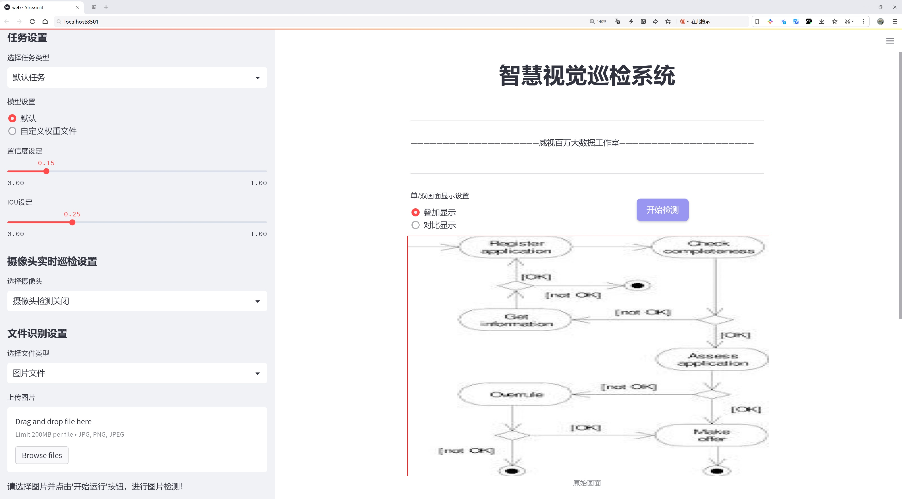
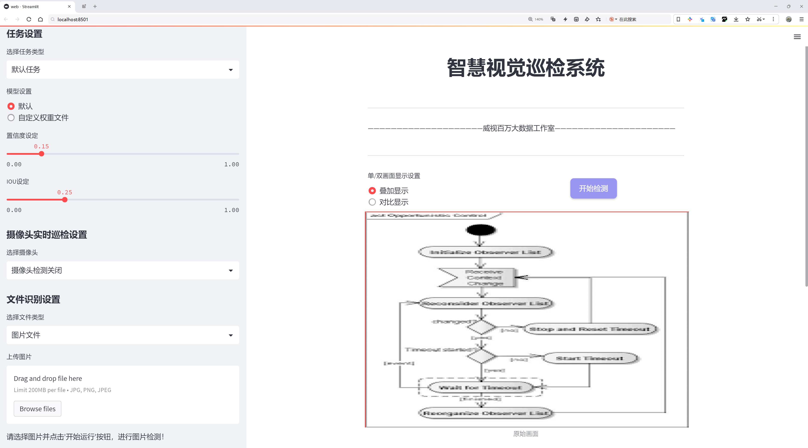
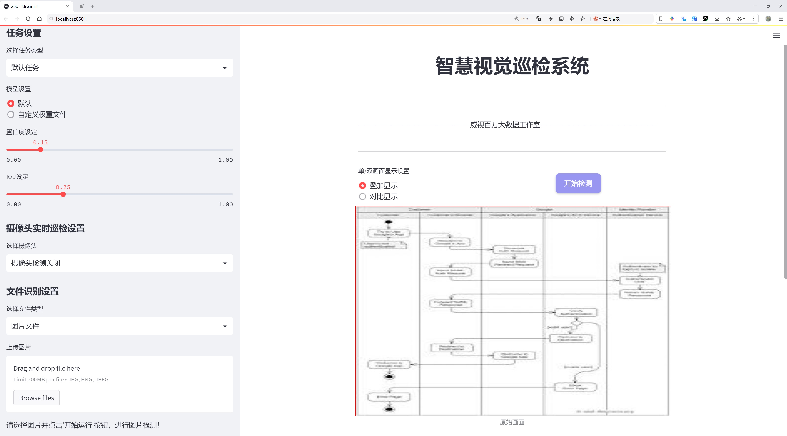
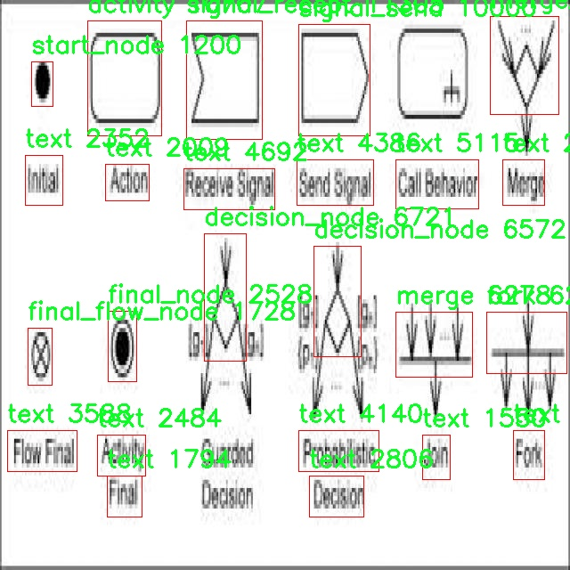
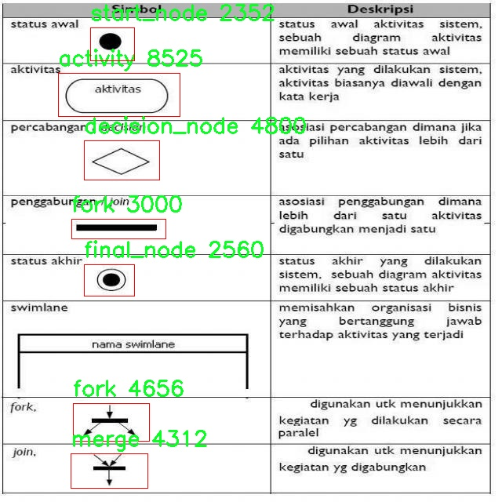
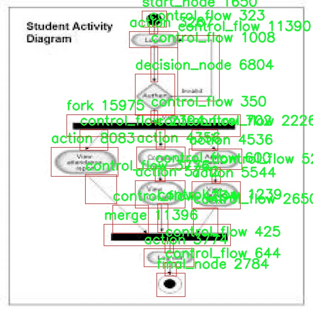
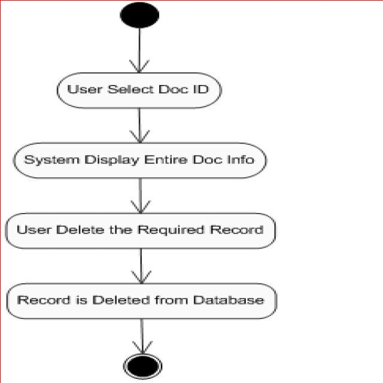
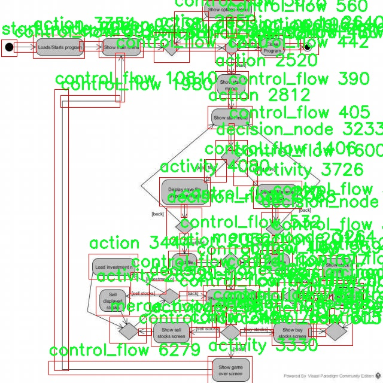

# 流程图节点检测检测系统源码分享
 # [一条龙教学YOLOV8标注好的数据集一键训练_70+全套改进创新点发刊_Web前端展示]

### 1.研究背景与意义

项目参考[AAAI Association for the Advancement of Artificial Intelligence](https://gitee.com/qunshansj/projects)

项目来源[AACV Association for the Advancement of Computer Vision](https://gitee.com/qunmasj/projects)

研究背景与意义

在信息化和数字化迅速发展的今天，流程图作为一种重要的可视化工具，广泛应用于各个领域，包括软件开发、项目管理、业务流程优化等。流程图不仅能够清晰地表达复杂的逻辑关系，还能有效地帮助团队成员理解和沟通。因此，自动化的流程图节点检测系统的研究显得尤为重要。传统的流程图分析往往依赖人工识别和标注，不仅效率低下，而且容易受到人为因素的影响，导致错误和遗漏。为了解决这一问题，基于深度学习的目标检测技术，尤其是YOLO（You Only Look Once）系列模型，提供了一种高效、准确的解决方案。

YOLOv8作为YOLO系列中的最新版本，凭借其优越的实时检测能力和高精度，成为了研究流程图节点检测的理想选择。该模型通过将目标检测任务转化为回归问题，实现了对图像中多个目标的快速定位和分类。为了适应流程图节点的多样性和复杂性，我们设计了一种改进的YOLOv8模型，旨在提高其在特定应用场景下的检测性能。该模型不仅能够识别标准的流程图节点，如开始节点、决策节点、控制流节点等，还能处理各种文本和符号，确保对流程图的全面理解。

本研究使用的数据集包含2688张图像，涵盖19个类别的节点信息，包括动作、活动、评论、控制流、决策节点等。这些类别的多样性为模型的训练提供了丰富的样本，有助于提高模型的泛化能力和适应性。通过对这些数据的深入分析，我们能够更好地理解流程图的结构特征，从而为模型的改进提供理论支持。

研究的意义不仅体现在技术层面，更在于其对实际应用的推动作用。通过构建高效的流程图节点检测系统，我们能够大幅提升流程图的自动化处理能力，减少人工干预，提高工作效率。此外，该系统的成功应用将为其他领域的图像识别任务提供借鉴，推动相关技术的发展和应用。比如，在教育领域，自动化的流程图生成和分析工具可以帮助学生更好地理解复杂的概念；在企业管理中，自动化的流程图生成可以加速决策过程，提升团队协作效率。

综上所述，基于改进YOLOv8的流程图节点检测系统的研究不仅具有重要的学术价值，还有广泛的应用前景。通过深入探索流程图节点的特征和检测方法，我们希望能够为相关领域提供新的思路和解决方案，推动自动化技术的进一步发展。

### 2.图片演示







##### 注意：由于此博客编辑较早，上面“2.图片演示”和“3.视频演示”展示的系统图片或者视频可能为老版本，新版本在老版本的基础上升级如下：（实际效果以升级的新版本为准）

  （1）适配了YOLOV8的“目标检测”模型和“实例分割”模型，通过加载相应的权重（.pt）文件即可自适应加载模型。

  （2）支持“图片识别”、“视频识别”、“摄像头实时识别”三种识别模式。

  （3）支持“图片识别”、“视频识别”、“摄像头实时识别”三种识别结果保存导出，解决手动导出（容易卡顿出现爆内存）存在的问题，识别完自动保存结果并导出到tempDir中。

  （4）支持Web前端系统中的标题、背景图等自定义修改，后面提供修改教程。

  另外本项目提供训练的数据集和训练教程,暂不提供权重文件（best.pt）,需要您按照教程进行训练后实现图片演示和Web前端界面演示的效果。

### 3.视频演示

[3.1 视频演示](https://www.bilibili.com/video/BV1Kgt8edERu/)

### 4.数据集信息展示

##### 4.1 本项目数据集详细数据（类别数＆类别名）

nc: 19
names: ['action', 'activity', 'commeent', 'control_flow', 'control_flowcontrol_flow', 'decision_node', 'exit_node', 'final_flow_node', 'final_node', 'fork', 'merge', 'merge_noode', 'null', 'object', 'object_flow', 'signal_recept', 'signal_send', 'start_node', 'text']


##### 4.2 本项目数据集信息介绍

数据集信息展示

在现代计算机视觉领域，数据集的构建与应用是推动算法进步的关键因素之一。本研究所使用的数据集名为“flow chart node detection”，旨在为改进YOLOv8的流程图节点检测系统提供强有力的支持。该数据集包含19个类别，涵盖了流程图中各类节点的多样性与复杂性，为模型的训练与评估提供了丰富的样本。

首先，数据集中的类别设计经过精心挑选，确保能够覆盖流程图中常见的节点类型。这19个类别分别为：action（动作）、activity（活动）、commeent（评论）、control_flow（控制流）、control_flowcontrol_flow（控制流控制流）、decision_node（决策节点）、exit_node（退出节点）、final_flow_node（最终流程节点）、final_node（最终节点）、fork（分支）、merge（合并）、merge_noode（合并节点）、null（空节点）、object（对象）、object_flow（对象流）、signal_recept（信号接收）、signal_send（信号发送）、start_node（起始节点）以及text（文本）。这些类别不仅涵盖了流程图的基本构成元素，还考虑到了实际应用中可能遇到的各种特殊情况。

在数据集的构建过程中，样本的多样性和标注的准确性是至关重要的。每个类别的样本均经过严格的筛选与标注，确保其在视觉特征上具有代表性。这种精细化的标注策略为YOLOv8模型的训练提供了高质量的输入数据，使得模型能够更好地学习到不同节点的特征和语义信息。此外，数据集中的样本还包括了不同风格和复杂度的流程图，进一步增强了模型的泛化能力。

为了提高模型的鲁棒性，数据集还考虑了多种干扰因素，如不同的背景、光照条件和节点排列方式。这些因素的引入不仅使得数据集更加贴近实际应用场景，也为模型的训练提供了更多的挑战，促使其在面对复杂环境时依然能够保持较高的检测精度。

在数据集的使用过程中，研究者可以通过对不同类别节点的检测结果进行分析，深入理解模型在特定类别上的表现。这种分析不仅有助于发现模型的优缺点，还能为后续的改进提供重要的参考依据。例如，如果模型在某一特定节点类型（如decision_node或fork）上的检测精度较低，研究者可以针对性地调整训练策略或增加该类别的样本量，以提升模型的整体性能。

总之，“flow chart node detection”数据集为改进YOLOv8的流程图节点检测系统提供了丰富的资源与支持。通过精心设计的类别和高质量的样本，研究者能够有效地训练出一个具有良好检测能力的模型，为流程图的自动化分析与处理奠定坚实的基础。随着技术的不断进步，未来的数据集构建与应用将更加注重多样性与实用性，以适应日益复杂的视觉识别任务。











### 5.全套项目环境部署视频教程（零基础手把手教学）

[5.1 环境部署教程链接（零基础手把手教学）](https://www.ixigua.com/7404473917358506534?logTag=c807d0cbc21c0ef59de5)


[5.2 安装Python虚拟环境创建和依赖库安装视频教程链接（零基础手把手教学）](https://www.ixigua.com/7404474678003106304?logTag=1f1041108cd1f708b01a)

### 6.手把手YOLOV8训练视频教程（零基础小白有手就能学会）

[6.1 手把手YOLOV8训练视频教程（零基础小白有手就能学会）](https://www.ixigua.com/7404477157818401292?logTag=d31a2dfd1983c9668658)

### 7.70+种全套YOLOV8创新点代码加载调参视频教程（一键加载写好的改进模型的配置文件）

[7.1 70+种全套YOLOV8创新点代码加载调参视频教程（一键加载写好的改进模型的配置文件）](https://www.ixigua.com/7404478314661806627?logTag=29066f8288e3f4eea3a4)

### 8.70+种全套YOLOV8创新点原理讲解（非科班也可以轻松写刊发刊，V10版本正在科研待更新）

由于篇幅限制，每个创新点的具体原理讲解就不一一展开，具体见下列网址中的创新点对应子项目的技术原理博客网址【Blog】：


[8.1 70+种全套YOLOV8创新点原理讲解链接](https://gitee.com/qunmasj/good)

### 9.系统功能展示（检测对象为举例，实际内容以本项目数据集为准）

图9.1.系统支持检测结果表格显示

  图9.2.系统支持置信度和IOU阈值手动调节

  图9.3.系统支持自定义加载权重文件best.pt(需要你通过步骤5中训练获得)

  图9.4.系统支持摄像头实时识别

  图9.5.系统支持图片识别

  图9.6.系统支持视频识别

  图9.7.系统支持识别结果文件自动保存

  图9.8.系统支持Excel导出检测结果数据


### 10.原始YOLOV8算法原理

原始YOLOv8算法原理

YOLOv8算法是目标检测领域的一项重要进展，由Glenn-Jocher提出，延续了YOLO系列算法的优良传统，尤其是YOLOv3和YOLOv5的核心思想与结构。YOLOv8在多个方面进行了创新和改进，使其在速度、精度和易用性上都达到了新的高度。

首先，在数据预处理方面，YOLOv8依然采用了YOLOv5的策略，强调数据增强的重要性。具体而言，YOLOv8在训练过程中使用了四种主要的增强手段：马赛克增强（Mosaic）、混合增强（Mixup）、空间扰动（Random Perspective）和颜色扰动（HSV Augment）。这些增强手段不仅丰富了训练数据的多样性，还有效提升了模型的鲁棒性，使其在面对复杂背景和不同光照条件时，依然能够保持较高的检测精度。

在骨干网络结构上，YOLOv8的设计灵感来源于YOLOv5，继承了其清晰的架构规律。YOLOv5的主干网络通过使用步长为2的3×3卷积层来降采样特征图，并接入C3模块以强化特征提取。而在YOLOv8中，C3模块被新颖的C2f模块所替代。C2f模块的设计增加了更多的分支，旨在丰富梯度回传时的支流，从而提升特征提取的效率和准确性。这种模块的改进，使得YOLOv8在特征学习上更具灵活性，能够更好地捕捉到目标的细微特征。

在特征融合方面，YOLOv8依然采用了FPN（Feature Pyramid Network）和PAN（Path Aggregation Network）结构，这一结构的优势在于能够有效融合多尺度信息。尽管FPN-PAN中的C3模块被替换为C2f模块，但整体结构与YOLOv5保持一致。这种设计确保了不同尺度特征之间的充分交互，使得YOLOv8在处理各种尺寸的目标时，能够实现更为精确的检测。

YOLOv8在检测头结构上也进行了显著的改进。传统的YOLO系列模型（如YOLOv3和YOLOv5）采用耦合头（Coupled Head），即通过一层卷积同时完成分类和定位任务。而YOLOv8则引入了解耦头（Decoupled Head）的设计，采用两条并行的分支，分别提取类别特征和位置特征。每条分支使用一层1×1卷积进行分类和定位任务的输出。这种解耦设计不仅提高了模型的灵活性，还有效降低了任务之间的干扰，使得分类和定位的性能得到了显著提升。

在标签分配策略方面，YOLOv8也进行了创新。虽然YOLOv5引入了自动聚类候选框的功能，但这种方法依赖于数据集的充分性，若数据集不够全面，聚类结果可能与真实物体的尺寸比例相差甚远。YOLOv8摒弃了候选框策略，转而采用了TOOD（Task-Oriented Object Detection）策略，这是一种动态标签分配策略。YOLOv8的损失函数主要由类别损失和位置损失两部分组成，其中类别损失采用了变焦损失（Varifocal Loss），而位置损失则结合了CIoU（Complete Intersection over Union）损失和DFL（Distributions Focal Loss）损失。这种损失设计使得YOLOv8在处理正负样本时，能够更为精准地反映样本的真实分布，进而提升检测性能。

YOLOv8的分类损失通过不对称参数对正负样本进行加权，确保了高质量正样本对损失的贡献更大，而负样本的影响则被有效降低。这种策略使得模型在训练过程中，能够更加专注于高质量样本的学习，从而提升整体的检测精度。

此外，YOLOv8的整体网络结构经过优化，采用了更为轻量化的设计，使得其在保持高效能的同时，降低了计算复杂度。这种轻量化设计不仅使得YOLOv8能够在资源受限的设备上运行，还扩展了其在实际应用中的适用范围。

总的来说，YOLOv8算法在多个方面进行了深入的改进和创新，结合了现代深度学习的先进思想，使其在目标检测任务中展现出更快的推理速度和更高的检测精度。通过对骨干网络、特征融合、检测头和标签分配策略的全面优化，YOLOv8不仅继承了YOLO系列的优良传统，更在此基础上实现了质的飞跃，成为当前目标检测领域中最具竞争力的算法之一。随着YOLOv8的不断发展和应用，未来在各类实际场景中的表现将更加令人期待。


### 11.项目核心源码讲解（再也不用担心看不懂代码逻辑）

#### 11.1 70+种YOLOv8算法改进源码大全和调试加载训练教程（非必要）\ultralytics\models\yolo\detect\predict.py

以下是对给定代码的核心部分进行提炼和详细注释的结果：

```python
# Ultralytics YOLO 🚀, AGPL-3.0 license

from ultralytics.engine.predictor import BasePredictor  # 导入基础预测器类
from ultralytics.engine.results import Results  # 导入结果类
from ultralytics.utils import ops  # 导入操作工具类

class DetectionPredictor(BasePredictor):
    """
    DetectionPredictor类扩展了BasePredictor类，用于基于检测模型进行预测。
    """

    def postprocess(self, preds, img, orig_imgs):
        """
        对预测结果进行后处理，并返回Results对象的列表。

        参数:
            preds: 模型的预测结果
            img: 输入图像
            orig_imgs: 原始图像列表或张量

        返回:
            results: 包含后处理结果的Results对象列表
        """
        # 应用非极大值抑制（NMS）来过滤重叠的检测框
        preds = ops.non_max_suppression(preds,
                                        self.args.conf,  # 置信度阈值
                                        self.args.iou,  # IOU阈值
                                        agnostic=self.args.agnostic_nms,  # 是否使用类别无关的NMS
                                        max_det=self.args.max_det,  # 最大检测框数量
                                        classes=self.args.classes)  # 过滤的类别

        # 如果输入的原始图像不是列表，则将其转换为numpy数组
        if not isinstance(orig_imgs, list):  # 输入图像是torch.Tensor而不是列表
            orig_imgs = ops.convert_torch2numpy_batch(orig_imgs)  # 转换为numpy批量数组

        results = []  # 初始化结果列表
        for i, pred in enumerate(preds):  # 遍历每个预测结果
            orig_img = orig_imgs[i]  # 获取对应的原始图像
            # 将预测框的坐标缩放到原始图像的尺寸
            pred[:, :4] = ops.scale_boxes(img.shape[2:], pred[:, :4], orig_img.shape)
            img_path = self.batch[0][i]  # 获取图像路径
            # 创建Results对象并添加到结果列表
            results.append(Results(orig_img, path=img_path, names=self.model.names, boxes=pred))
        return results  # 返回后处理的结果列表
```

### 代码核心部分说明：
1. **类定义**：`DetectionPredictor` 继承自 `BasePredictor`，用于实现基于检测模型的预测功能。
2. **后处理方法**：`postprocess` 方法对模型的预测结果进行后处理，主要包括：
   - 应用非极大值抑制（NMS）来去除重叠的检测框。
   - 将原始图像从张量格式转换为numpy数组（如果需要）。
   - 缩放预测框的坐标以适应原始图像的尺寸。
   - 创建并返回包含所有预测结果的 `Results` 对象列表。 

这些核心部分和注释提供了对代码功能的清晰理解，便于后续的使用和维护。

这个文件是Ultralytics YOLO模型中的一个预测模块，主要用于基于检测模型进行目标检测的预测。文件中定义了一个名为`DetectionPredictor`的类，它继承自`BasePredictor`类，扩展了基础预测功能。

在类的文档字符串中，提供了一个使用示例，展示了如何创建`DetectionPredictor`的实例并调用其预测功能。示例中，首先导入必要的模块，然后通过传入模型路径和数据源来初始化预测器，最后调用`predict_cli()`方法进行预测。

`DetectionPredictor`类中有一个重要的方法`postprocess`，该方法负责对模型的预测结果进行后处理。具体来说，`postprocess`方法接收三个参数：`preds`（模型的预测结果）、`img`（输入图像）和`orig_imgs`（原始图像）。在方法内部，首先调用`ops.non_max_suppression`函数对预测结果进行非极大值抑制，以去除冗余的检测框。这个过程涉及到多个参数，如置信度阈值、IOU阈值、是否进行类别无关的NMS、最大检测框数量以及需要检测的类别。

接下来，方法检查输入的原始图像是否为列表，如果不是，则将其转换为NumPy数组。然后，方法遍历每个预测结果，并根据原始图像的尺寸对预测框进行缩放，以确保框的位置和大小与原始图像相匹配。每个预测结果和对应的原始图像路径被封装成`Results`对象，并添加到结果列表中。

最后，`postprocess`方法返回一个包含所有结果的列表，供后续使用。这种结构使得该模块能够高效地处理目标检测任务，并提供清晰的结果输出。

#### 11.2 ui.py

以下是代码中最核心的部分，并附上详细的中文注释：

```python
import sys
import subprocess

def run_script(script_path):
    """
    使用当前 Python 环境运行指定的脚本。

    Args:
        script_path (str): 要运行的脚本路径

    Returns:
        None
    """
    # 获取当前 Python 解释器的路径
    python_path = sys.executable

    # 构建运行命令，使用 streamlit 运行指定的脚本
    command = f'"{python_path}" -m streamlit run "{script_path}"'

    # 执行命令
    result = subprocess.run(command, shell=True)
    # 检查命令执行的返回码，如果不为0，表示执行出错
    if result.returncode != 0:
        print("脚本运行出错。")

# 实例化并运行应用
if __name__ == "__main__":
    # 指定要运行的脚本路径
    script_path = "web.py"  # 这里可以直接指定脚本名称

    # 调用函数运行脚本
    run_script(script_path)
```

### 代码注释说明：
1. **导入模块**：
   - `sys`：用于访问与 Python 解释器紧密相关的变量和函数。
   - `subprocess`：用于创建新进程、连接到它们的输入/输出/错误管道，并获取它们的返回码。

2. **定义 `run_script` 函数**：
   - 该函数接受一个参数 `script_path`，表示要运行的 Python 脚本的路径。
   - 使用 `sys.executable` 获取当前 Python 解释器的路径，以确保使用正确的 Python 环境来运行脚本。
   - 构建一个命令字符串，使用 `streamlit` 模块来运行指定的脚本。
   - 使用 `subprocess.run` 执行构建的命令，并通过 `shell=True` 允许在 shell 中执行命令。
   - 检查命令的返回码，如果返回码不为0，表示脚本运行出错，打印错误信息。

3. **主程序入口**：
   - 使用 `if __name__ == "__main__":` 确保该代码块仅在脚本直接运行时执行，而不是作为模块导入时执行。
   - 指定要运行的脚本路径（这里是 `web.py`）。
   - 调用 `run_script` 函数来执行指定的脚本。

这个程序文件的主要功能是通过当前的 Python 环境来运行一个指定的脚本，具体是使用 Streamlit 框架来启动一个 Web 应用。程序首先导入了必要的模块，包括 `sys`、`os` 和 `subprocess`，这些模块分别用于获取系统信息、处理文件路径和执行外部命令。

在文件中定义了一个名为 `run_script` 的函数，该函数接受一个参数 `script_path`，表示要运行的脚本的路径。函数内部首先获取当前 Python 解释器的路径，这通过 `sys.executable` 实现。接着，构建一个命令字符串，该命令使用当前的 Python 解释器来运行指定的脚本，具体是通过 `streamlit run` 命令来启动 Web 应用。

随后，使用 `subprocess.run` 方法来执行构建好的命令。这个方法会在一个新的 shell 中运行命令，并等待其完成。如果命令执行后返回的状态码不为零，表示脚本运行出错，程序会输出一条错误信息。

在文件的最后部分，使用 `if __name__ == "__main__":` 语句来确保只有在直接运行该文件时才会执行后面的代码。这里指定了要运行的脚本路径为 `web.py`，并调用 `run_script` 函数来启动这个脚本。

总的来说，这个程序的功能是简化了使用 Streamlit 启动 Web 应用的过程，通过封装在 `run_script` 函数中，使得用户只需提供脚本路径即可轻松运行。

#### 11.3 code\ultralytics\models\yolo\pose\__init__.py

以下是代码中最核心的部分，并附上详细的中文注释：

```python
# 导入必要的模块
from .predict import PosePredictor  # 导入姿态预测器类
from .train import PoseTrainer      # 导入姿态训练器类
from .val import PoseValidator       # 导入姿态验证器类

# 定义模块的公开接口
__all__ = "PoseTrainer", "PoseValidator", "PosePredictor"  # 指定可以被外部访问的类
```

### 注释说明：
1. **导入模块**：
   - `from .predict import PosePredictor`：从当前包的 `predict` 模块中导入 `PosePredictor` 类，该类负责进行姿态预测。
   - `from .train import PoseTrainer`：从当前包的 `train` 模块中导入 `PoseTrainer` 类，该类用于训练姿态模型。
   - `from .val import PoseValidator`：从当前包的 `val` 模块中导入 `PoseValidator` 类，该类用于验证姿态模型的性能。

2. **定义公开接口**：
   - `__all__` 是一个特殊变量，用于定义模块的公共接口。当使用 `from module import *` 时，只有在 `__all__` 中列出的名称会被导入。这里列出了 `PoseTrainer`、`PoseValidator` 和 `PosePredictor`，表示这三个类是该模块对外提供的功能。

这个程序文件是Ultralytics YOLO项目中的一个初始化文件，通常用于模块的组织和导入。在这个文件中，首先包含了一条版权声明，表明该代码遵循AGPL-3.0许可证。

接下来，文件从同一目录下导入了三个类：`PosePredictor`、`PoseTrainer`和`PoseValidator`。这些类分别负责姿态预测、模型训练和验证。这种结构使得在其他模块中使用这些功能时更加方便，因为用户只需导入这个包即可访问这些类。

最后，`__all__`变量被定义为一个元组，包含了三个类的名称。这意味着当使用`from module import *`语句时，只会导入这三个类，从而控制了模块的公共接口，避免不必要的名称冲突或意外导入其他未公开的内容。

总体来说，这个文件的主要作用是将姿态估计相关的功能模块化，并提供一个清晰的接口供其他部分调用。

#### 11.4 train.py

以下是经过简化和注释的核心代码部分，主要集中在YOLO检测模型的训练过程。

```python
import random
import numpy as np
import torch.nn as nn
from ultralytics.data import build_dataloader, build_yolo_dataset
from ultralytics.engine.trainer import BaseTrainer
from ultralytics.models import yolo
from ultralytics.nn.tasks import DetectionModel
from ultralytics.utils import LOGGER, RANK
from ultralytics.utils.torch_utils import de_parallel, torch_distributed_zero_first

class DetectionTrainer(BaseTrainer):
    """
    扩展自BaseTrainer类，用于基于检测模型的训练。
    """

    def build_dataset(self, img_path, mode="train", batch=None):
        """
        构建YOLO数据集。

        参数:
            img_path (str): 包含图像的文件夹路径。
            mode (str): 模式，可以是'train'或'val'，用户可以为每种模式自定义不同的增强。
            batch (int, optional): 批次大小，适用于'rect'模式。默认为None。
        """
        gs = max(int(de_parallel(self.model).stride.max() if self.model else 0), 32)
        return build_yolo_dataset(self.args, img_path, batch, self.data, mode=mode, rect=mode == "val", stride=gs)

    def get_dataloader(self, dataset_path, batch_size=16, rank=0, mode="train"):
        """构造并返回数据加载器。"""
        assert mode in ["train", "val"]
        with torch_distributed_zero_first(rank):  # 在分布式训练中，确保数据集只初始化一次
            dataset = self.build_dataset(dataset_path, mode, batch_size)
        shuffle = mode == "train"  # 训练模式下打乱数据
        workers = self.args.workers if mode == "train" else self.args.workers * 2
        return build_dataloader(dataset, batch_size, workers, shuffle, rank)  # 返回数据加载器

    def preprocess_batch(self, batch):
        """对一批图像进行预处理，包括缩放和转换为浮点数。"""
        batch["img"] = batch["img"].to(self.device, non_blocking=True).float() / 255  # 将图像转换为浮点数并归一化
        if self.args.multi_scale:  # 如果启用多尺度训练
            imgs = batch["img"]
            sz = (
                random.randrange(self.args.imgsz * 0.5, self.args.imgsz * 1.5 + self.stride)
                // self.stride
                * self.stride
            )  # 随机选择一个尺寸
            sf = sz / max(imgs.shape[2:])  # 计算缩放因子
            if sf != 1:
                ns = [
                    math.ceil(x * sf / self.stride) * self.stride for x in imgs.shape[2:]
                ]  # 计算新的形状
                imgs = nn.functional.interpolate(imgs, size=ns, mode="bilinear", align_corners=False)  # 进行插值缩放
            batch["img"] = imgs
        return batch

    def get_model(self, cfg=None, weights=None, verbose=True):
        """返回YOLO检测模型。"""
        model = DetectionModel(cfg, nc=self.data["nc"], verbose=verbose and RANK == -1)  # 创建检测模型
        if weights:
            model.load(weights)  # 加载权重
        return model

    def plot_training_samples(self, batch, ni):
        """绘制带有注释的训练样本。"""
        plot_images(
            images=batch["img"],
            batch_idx=batch["batch_idx"],
            cls=batch["cls"].squeeze(-1),
            bboxes=batch["bboxes"],
            paths=batch["im_file"],
            fname=self.save_dir / f"train_batch{ni}.jpg",
            on_plot=self.on_plot,
        )

    def plot_metrics(self):
        """从CSV文件中绘制指标。"""
        plot_results(file=self.csv, on_plot=self.on_plot)  # 保存结果图
```

### 代码说明
1. **构建数据集**：`build_dataset`方法用于根据给定的图像路径和模式（训练或验证）构建YOLO数据集。
2. **获取数据加载器**：`get_dataloader`方法构造数据加载器，确保在分布式训练中只初始化一次数据集。
3. **预处理批次**：`preprocess_batch`方法对输入的图像批次进行预处理，包括归一化和可能的多尺度调整。
4. **获取模型**：`get_model`方法用于创建YOLO检测模型，并可选择性地加载预训练权重。
5. **绘制训练样本和指标**：`plot_training_samples`和`plot_metrics`方法用于可视化训练过程中的样本和性能指标。

这个程序文件 `train.py` 是一个用于训练 YOLO（You Only Look Once）目标检测模型的实现，继承自 `BaseTrainer` 类。它包含了多个方法，用于构建数据集、获取数据加载器、预处理图像批次、设置模型属性、获取模型、验证模型、记录损失、显示训练进度、绘制训练样本和绘制训练指标等。

在 `DetectionTrainer` 类中，`build_dataset` 方法用于构建 YOLO 数据集，接收图像路径、模式（训练或验证）和批次大小作为参数。它通过调用 `build_yolo_dataset` 函数来生成数据集，并根据模型的步幅设置适当的参数。

`get_dataloader` 方法用于构建并返回数据加载器。它根据模式（训练或验证）来初始化数据集，并设置是否打乱数据。若数据集是矩形模式且为训练模式，则会发出警告，因为这两者不兼容。

`preprocess_batch` 方法对图像批次进行预处理，包括将图像缩放并转换为浮点数。它还支持多尺度训练，通过随机选择图像大小来增强模型的鲁棒性。

`set_model_attributes` 方法用于设置模型的属性，包括类别数量和类别名称等。这些属性会在模型训练过程中使用。

`get_model` 方法返回一个 YOLO 检测模型，支持加载预训练权重。

`get_validator` 方法返回一个用于验证 YOLO 模型的验证器，能够记录损失值以便后续分析。

`label_loss_items` 方法用于返回带有标签的训练损失项字典，便于跟踪训练过程中的损失变化。

`progress_string` 方法返回一个格式化的字符串，显示训练进度，包括当前的 epoch、GPU 内存使用情况、损失值、实例数量和图像大小等信息。

`plot_training_samples` 方法用于绘制训练样本及其标注，帮助可视化训练数据的质量。

最后，`plot_metrics` 和 `plot_training_labels` 方法分别用于绘制训练过程中的指标和生成带标签的训练图，以便分析模型的表现和训练效果。

整体而言，这个文件提供了一个完整的框架，用于训练 YOLO 模型，涵盖了数据处理、模型构建、训练监控和结果可视化等多个方面。

#### 11.5 70+种YOLOv8算法改进源码大全和调试加载训练教程（非必要）\ultralytics\nn\extra_modules\ops_dcnv3\functions\__init__.py

以下是代码中最核心的部分，并附上详细的中文注释：

```python
# 导入自定义的DCNv3函数和核心功能
from .dcnv3_func import DCNv3Function, dcnv3_core_pytorch
```

### 注释说明：
1. `from .dcnv3_func import DCNv3Function, dcnv3_core_pytorch`：
   - 这一行代码用于从当前包（用`.`表示）中的 `dcnv3_func` 模块导入两个核心组件：`DCNv3Function` 和 `dcnv3_core_pytorch`。
   - `DCNv3Function` 可能是一个自定义的函数或类，用于实现 DCNv3（Deformable Convolutional Networks v3）相关的功能。
   - `dcnv3_core_pytorch` 可能是与 PyTorch 框架兼容的核心实现，提供了必要的操作或功能以支持 DCNv3 的使用。

通过这种方式，代码能够利用这些导入的功能来实现更复杂的操作或模型，尤其是在深度学习和计算机视觉领域。

这个程序文件是一个Python模块的初始化文件，文件名为`__init__.py`，它位于`ultralytics\nn\extra_modules\ops_dcnv3\functions`目录下。这个文件的主要作用是将该目录下的模块或功能导入到包中，使得在使用该包时可以直接访问这些功能。

文件开头有一段注释，说明了版权信息和许可证类型。这里提到的“InternImage”是一个项目名称，版权归OpenGVLab所有，并且该项目是根据MIT许可证进行授权的，这意味着用户可以自由使用、修改和分发该代码，只要遵循许可证的条款。

在文件的主体部分，代码通过`from .dcnv3_func import DCNv3Function, dcnv3_core_pytorch`这一行，将`dcnv3_func`模块中的`DCNv3Function`和`dcnv3_core_pytorch`两个功能导入到当前模块中。通过这种方式，用户在导入`ops_dcnv3`模块时，可以直接使用这两个功能，而无需单独导入`dcnv3_func`模块。

总体来说，这个`__init__.py`文件的作用是为了简化模块的使用，使得相关功能能够更方便地被访问和调用。

#### 11.6 70+种YOLOv8算法改进源码大全和调试加载训练教程（非必要）\ultralytics\trackers\basetrack.py

以下是代码中最核心的部分，并附上详细的中文注释：

```python
from collections import OrderedDict
import numpy as np

class TrackState:
    """跟踪状态的枚举类，表示对象跟踪的不同状态。"""
    New = 0      # 新跟踪
    Tracked = 1  # 正在跟踪
    Lost = 2     # 跟踪丢失
    Removed = 3  # 跟踪已移除

class BaseTrack:
    """对象跟踪的基类，处理基本的跟踪属性和操作。"""

    _count = 0  # 全局跟踪ID计数器

    track_id = 0  # 当前跟踪的ID
    is_activated = False  # 跟踪是否被激活
    state = TrackState.New  # 跟踪的初始状态

    history = OrderedDict()  # 存储跟踪历史的有序字典
    features = []  # 存储特征的列表
    curr_feature = None  # 当前特征
    score = 0  # 跟踪的评分
    start_frame = 0  # 跟踪开始的帧
    frame_id = 0  # 当前帧ID
    time_since_update = 0  # 自上次更新以来的时间

    # 多摄像头支持
    location = (np.inf, np.inf)  # 跟踪对象的位置，初始化为无穷大

    @property
    def end_frame(self):
        """返回跟踪的最后帧ID。"""
        return self.frame_id

    @staticmethod
    def next_id():
        """递增并返回全局跟踪ID计数器。"""
        BaseTrack._count += 1
        return BaseTrack._count

    def activate(self, *args):
        """激活跟踪，使用提供的参数进行初始化。"""
        raise NotImplementedError  # 子类需要实现此方法

    def predict(self):
        """预测跟踪的下一个状态。"""
        raise NotImplementedError  # 子类需要实现此方法

    def update(self, *args, **kwargs):
        """使用新的观测数据更新跟踪。"""
        raise NotImplementedError  # 子类需要实现此方法

    def mark_lost(self):
        """将跟踪标记为丢失。"""
        self.state = TrackState.Lost

    def mark_removed(self):
        """将跟踪标记为已移除。"""
        self.state = TrackState.Removed

    @staticmethod
    def reset_id():
        """重置全局跟踪ID计数器。"""
        BaseTrack._count = 0
```

### 代码说明：
1. **TrackState 类**：定义了跟踪对象的状态，包括新跟踪、正在跟踪、丢失和已移除四种状态。
2. **BaseTrack 类**：是一个基类，负责管理跟踪对象的基本属性和操作。包括跟踪ID、状态、历史记录、特征等。
3. **静态方法和属性**：
   - `next_id()`：用于生成唯一的跟踪ID。
   - `reset_id()`：用于重置跟踪ID计数器。
4. **跟踪状态更新**：提供了方法来标记跟踪对象为丢失或已移除。
5. **抽象方法**：`activate`、`predict` 和 `update` 方法是抽象的，要求子类实现具体的逻辑。

这个程序文件是YOLO（You Only Look Once）系列算法的一部分，主要用于目标跟踪的基础实现。文件中定义了一个用于目标跟踪的基本类`BaseTrack`，以及一个枚举类`TrackState`，用于表示目标跟踪的不同状态。

首先，`TrackState`类定义了四种可能的目标跟踪状态：新建（New）、跟踪中（Tracked）、丢失（Lost）和已移除（Removed）。这些状态可以帮助在跟踪过程中管理目标的生命周期。

接下来，`BaseTrack`类是目标跟踪的基础类，负责处理基本的跟踪属性和操作。类中定义了一些属性，例如`track_id`（跟踪ID）、`is_activated`（是否激活）、`state`（当前状态）、`history`（跟踪历史）、`features`（特征）、`score`（得分）、`start_frame`（起始帧）、`frame_id`（当前帧ID）和`time_since_update`（自上次更新以来的时间）。这些属性用于存储和管理跟踪目标的相关信息。

在`BaseTrack`类中，还定义了一些方法。`end_frame`属性返回跟踪的最后一帧ID。`next_id`静态方法用于递增并返回全局跟踪ID计数器，以确保每个跟踪目标都有唯一的ID。`activate`、`predict`和`update`方法是抽象方法，分别用于激活跟踪、预测下一个状态和更新跟踪，具体实现需要在子类中定义。`mark_lost`和`mark_removed`方法用于将跟踪状态标记为丢失或已移除。

最后，`reset_id`静态方法用于重置全局跟踪ID计数器，方便在需要时重新开始跟踪。

总体而言，这个文件为YOLO算法中的目标跟踪提供了一个基础框架，后续可以在此基础上进行具体的实现和扩展。

### 12.系统整体结构（节选）

### 整体功能和构架概括

该项目是一个基于YOLOv8的目标检测和跟踪框架，包含了多个模块和功能，旨在提供高效的目标检测、姿态估计、模型训练、跟踪以及其他相关功能。整体架构可以分为以下几个主要部分：

1. **目标检测**：通过`predict.py`文件实现YOLO模型的预测功能，能够对输入图像进行目标检测。
2. **模型训练**：`train.py`文件负责模型的训练过程，包括数据集构建、预处理、模型设置和训练监控等。
3. **目标跟踪**：`basetrack.py`文件提供了目标跟踪的基础类，支持对检测到的目标进行跟踪。
4. **用户界面**：`ui.py`文件通过Streamlit框架提供了一个简单的用户界面，方便用户运行和测试模型。
5. **额外模块**：包括自定义的神经网络模块和功能，例如`ops_dcnv3`、`attention.py`等，提供了模型的扩展和改进。
6. **工具和实用程序**：如`utils.py`和`checks.py`等文件，提供了各种辅助功能和检查机制，确保代码的稳定性和可用性。

### 文件功能整理表

| 文件路径                                                                                               | 功能描述                                           |
|--------------------------------------------------------------------------------------------------------|---------------------------------------------------|
| `ultralytics/models/yolo/detect/predict.py`                                                           | 实现YOLO模型的目标检测预测功能。                   |
| `ui.py`                                                                                               | 提供一个Streamlit用户界面，用于运行和测试模型。    |
| `ultralytics/models/yolo/pose/__init__.py`                                                           | 初始化姿态估计模块，导入相关类。                   |
| `train.py`                                                                                            | 负责YOLO模型的训练过程，包括数据集构建和训练监控。 |
| `ultralytics/nn/extra_modules/ops_dcnv3/functions/__init__.py`                                       | 初始化DCNv3模块，导入相关功能。                    |
| `ultralytics/trackers/basetrack.py`                                                                   | 提供目标跟踪的基础类和状态管理。                   |
| `code/ultralytics/engine/tuner.py`                                                                    | 负责模型超参数调优的功能。                         |
| `code/ultralytics/models/fastsam/predict.py`                                                          | 实现FastSAM模型的目标检测预测功能。                |
| `code/ultralytics/utils/checks.py`                                                                    | 提供各种检查和验证功能，确保代码的稳定性。         |
| `ultralytics/nn/backbone/lsknet.py`                                                                   | 定义LSKNet骨干网络，用于模型特征提取。             |
| `ultralytics/nn/extra_modules/attention.py`                                                           | 实现自定义的注意力机制模块。                       |
| `code/ultralytics/models/rtdetr/predict.py`                                                           | 实现RT-DETR模型的目标检测预测功能。                |
| `code/ultralytics/data/explorer/utils.py`                                                             | 提供数据探索和处理的实用工具函数。                 |

这个表格概述了项目中各个文件的主要功能，帮助理解整体架构和模块之间的关系。

注意：由于此博客编辑较早，上面“11.项目核心源码讲解（再也不用担心看不懂代码逻辑）”中部分代码可能会优化升级，仅供参考学习，完整“训练源码”、“Web前端界面”和“70+种创新点源码”以“13.完整训练+Web前端界面+70+种创新点源码、数据集获取”的内容为准。

### 13.完整训练+Web前端界面+70+种创新点源码、数据集获取


# [下载链接：https://mbd.pub/o/bread/ZpuWlJxv](https://mbd.pub/o/bread/ZpuWlJxv)